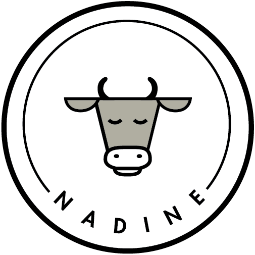

==================================
Welcome to Nadine
==================================

Nadine is a Django web project which runs behind the scenes of coworking spaces.

Nadine has four applications: Members, Staff, Admin, and Tablet.  These applications help your management team facilitate your coworking community.

License & Copyright
-------------------

Copyright 2020 `Office Nomads LLC <https://officenomads.com/>`_. Licensed under the Apache License, Version 2.0 (the "License"); you may not use this file except in compliance with the License.

You may obtain a copy of the License at https://opensource.org/licenses/Apache-2.0

Unless required by applicable law or agreed to in writing, software distributed under the License is distributed on an "AS IS" BASIS, WITHOUT WARRANTIES OR CONDITIONS OF ANY KIND, either express or implied.

See the License for the specific language governing permissions and limitations under the License.

Indices and tables
------------------

* :ref:`genindex`
* :ref:`modindex`
* :ref:`search`

.. toctree::
  :maxdepth: 1
  :glob:
  :caption: Getting Started

  requirements
  quickstart
  settings
  production

.. toctree::
  :maxdepth: 1
  :glob:
  :caption: Style Documentation

  app_structure
  themes
  django_templating
  static_files

.. toctree::
  :maxdepth: 1
  :glob:
  :caption: Staff Application

  staff_overview

.. toctree::
  :maxdepth: 1
  :glob:
  :caption: Advanced Topics

  testing
  mailing_lists
  ldap_sync
  events
